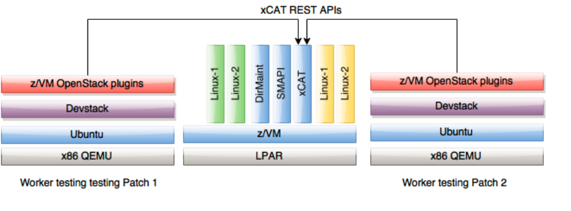

.. _ci:

========================
z/VM openstack driver CI
========================

This document is only for architecture reference.

openstack 3rd party CI
----------------------

Openstack requested 3rd party CI for vendor drivers, the detailed info
can be found at https://docs.openstack.org/infra/openstackci/third_party_ci.html.

z/VM CI hardware
----------------

The CI Cloud is an openstack liberty (may move as new releases are made available)
based cloud that is used to deploy test servers used to run the the devstack-gate
job(s) which run selected tempest tests. Openstack Liberty is used as the cloud
infrastructure is installed using the packages obtained from the Liberty apt
repository. An openstack controller, neutron and a compute node are installed in
virtual machines created using libvirt (virsh) hosted on Racker server 1.
Additional compute nodes are installed on Rack Servers 2, 3, 4.

.. image:: ./images/ci_arch.jpg

z/VM CI running sample
----------------------

Using an example of two tests servers running tempest tests each testing a different
openstack patch, this diagram shows additional detail of the bottom layer of the
preceding diagram. Each test server assumes it has a dedicated z/VM system that its
OpenStack nova plugins are using. 

The test server is an OpenStack controller; a devstack installation running on the
reference platform (x86 Ubuntu Linux) installed prior to running the tempest tests.
Each test servers OpenStack nova plugin for z/VM are configured to talk to some
z/VM system; depending upon how z/VM scales in practice, each worker might really
have its own dedicated z/VM back end, or each worker might actually be sharing a
z/VM instance as shown here. Each worker's plugin can be configured to use a
different prefix when creating virtual servers on z/VM, so they will not directly
collide.

z/VM CI reference and logs
--------------------------

* Logs: `<http://extbasicopstackcilog01.podc.sl.edst.ibm.com/test_logs/>`_
* Status: 
