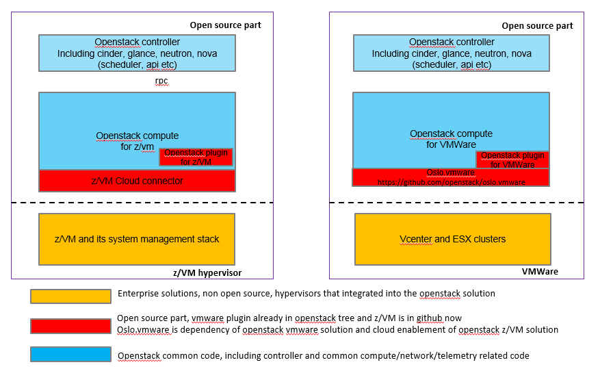

.. _topology:

========
Topology
========

Generic concepts and components
-------------------------------

Following picture shows a conceptual view of the relationship between any OpenStack solution and z/VM.

An OpenStack solution is free to run its components wherever it wishes; its options range from running
all components on z/VM, to running some on z/VM and others elsewhere, to running all components on
other platform(s). The solution is also free to source its components wherever it wishes, either using
z/VM. OpenStack enablement components or not.

z/VM ships a set of servers that provide local system management APIs. These servers consist of request
servers that accept local connections, receive the data, and then call one of a set of worker servers to
process the request. These servers are known collectively as SMAPI. The worker servers can interact with
the z/VM hypervisor (CP) or with a directory manager. A directory manager is required for this
environment.

Overall architecture
--------------------

z/VM openstack enablement rely on z/VM cloud connector, the compute service (nova-compute) can either
run on remote server other than z/VM itself or run on top of virtual server which hosted on z/VM.
 

.. image:: ./images/arch.jpg

Function Call flow
------------------

Following is a picture describe the call routine of spawn function,
openstack zvm driver managed zvm through REST API call provided by
zvm cloud connector.

.. actdiag::

    actdiag {
        nova.spawn -> driver.spawn -> sdk.createuser -> zvm.createuser ->
            sdk.adddisk -> zvm.adddisk -> sdk.setupnet -> zvm.setupnet

        lane nova-compute {
            label = "nova compute"
            nova.spawn [label = "nova compute driver spawn"]
        }

        lane zvm-driver {
            label = "zvm driver"
            driver.spawn [label = "zvm driver spawn"]
        }

        lane zvm-cloud-connector {
            label = "zvm cloud connector"
            sdk.createuser [label = "create zvm user definition"]
            sdk.adddisk [label = "add disk to created user"]
            sdk.setupnet [label = "setup network to created user"]
        }

        lane zvm-system-management {
            label = "zvm system management interface"
            zvm.createuser [label = "use zvm dirmaint to create user"]
            zvm.adddisk [label = "use zvm dirmaint and cp to add disk"]
            zvm.setupnet [label = "use zvm cp to setup network"]
        }
    }

Compare with vmware openstack driver
------------------------------------

Here's architecture comparsion between z/VM and vmware enablement for openstack.

