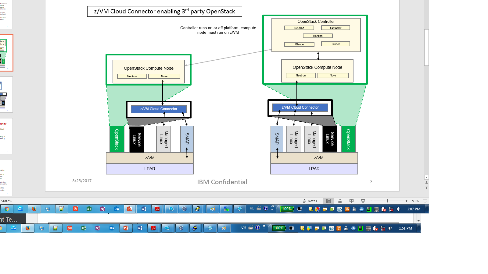

.. _topology:

========
Topology
========

Generic concepts and components
-------------------------------

Following picture shows a conceptual view of the relationship between any OpenStack solution and z/VM.

An OpenStack solution is free to run its components wherever it wishes; its options range from running
all components on z/VM, to running some on z/VM and others elsewhere, to running all components on
other platform(s). The solution is also free to source its components wherever it wishes, either using
z/VM. OpenStack enablement components or not.

z/VM ships a set of servers that provide local system management APIs. These servers consist of request
servers that accept local connections, receive the data, and then call one of a set of worker servers to
process the request. These servers are known collectively as SMAPI. The worker servers can interact with
the z/VM hypervisor (CP) or with a directory manager. A directory manager is required for this
environment.

Overall architecture
--------------------

