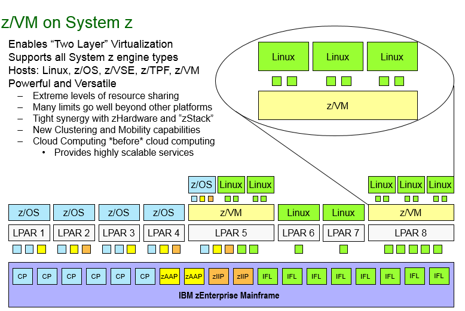
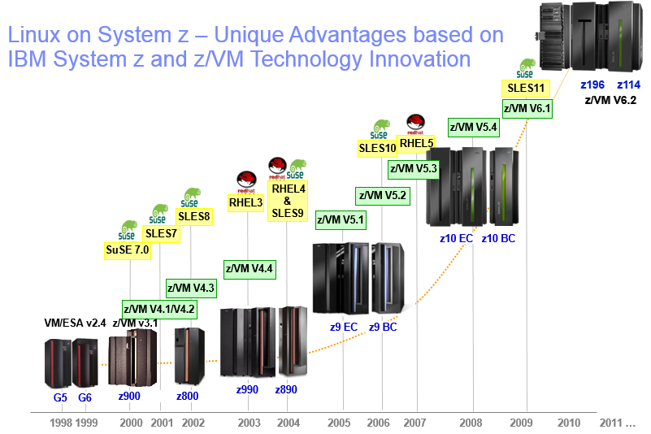

.. _zvm:

=================
z/VM Introduction
=================

This document gives basic information about z/VM itself and some history
about z/VM, for more detailed information, please refer to z/VM website
http://www.vm.ibm.com

z/VM
----
z/VM provides a highly secure and scalable enterprise cloud infrastructure
and an environment for efficiently running multiple diverse critical applications
on IBM z Systems and IBM LinuxONE with support for more virtual servers than
any other platform in a single footprint.
These z/VM virtual servers can run Linux, z/OS and more.

Linux on IBM z Systems and IBM LinuxONE offer a uniquely powerful, high-performance
solution. Supreme efficiency for optimized workload deployment, innovative system
management with IBM Wave for z/VM, and the legendary performance and scalability
of z/VM come together to form a foundation for your Linux applications that is
simple, cost-effective, efficient, and secure. 

z/VM has over 45 years history and it's keep being used in wide industries such as
banking, securities, insurence etc.

